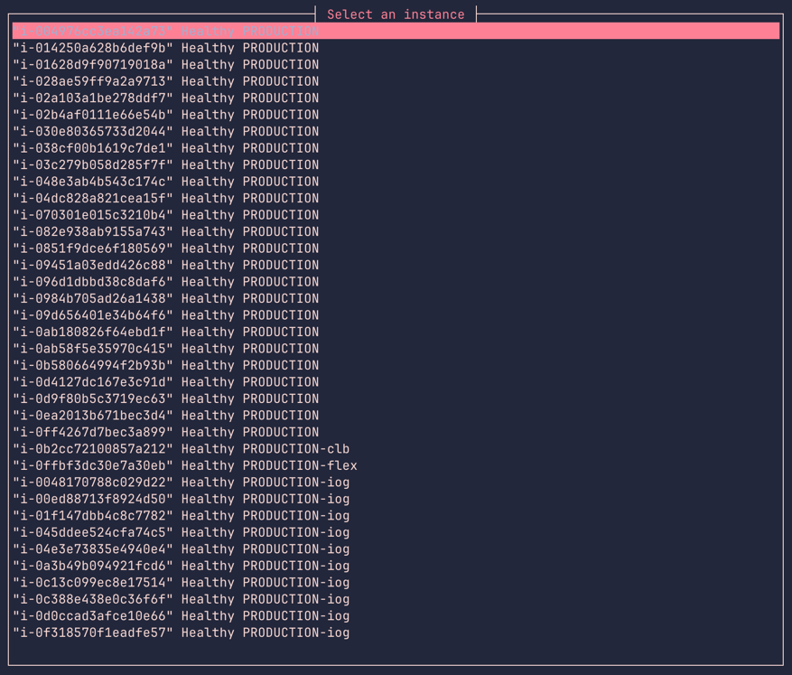

# rssm

A simple command-line tool to connect to EC2 instances.

### Prerequisites

1. Install Rust:

```shell
curl --proto '=https' --tlsv1.2 -sSf https://sh.rustup.rs | sh
```

### Build

```shell
make build
```

### Usage

```shell
./target/debug/rssm --profile=app-dev
```

